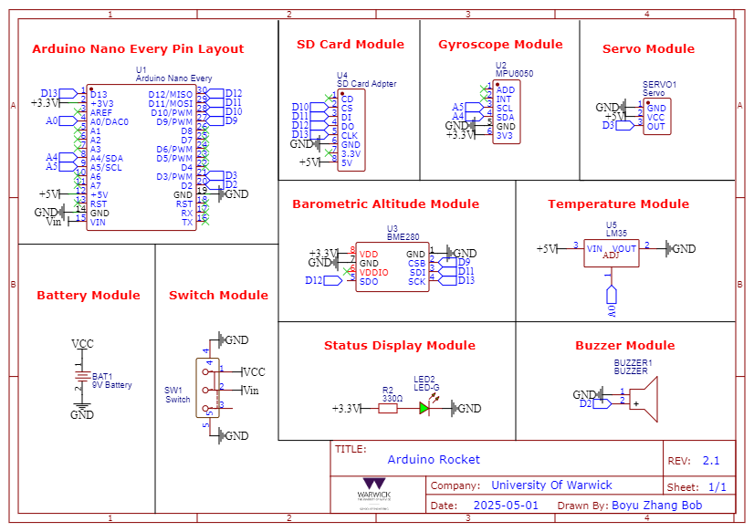
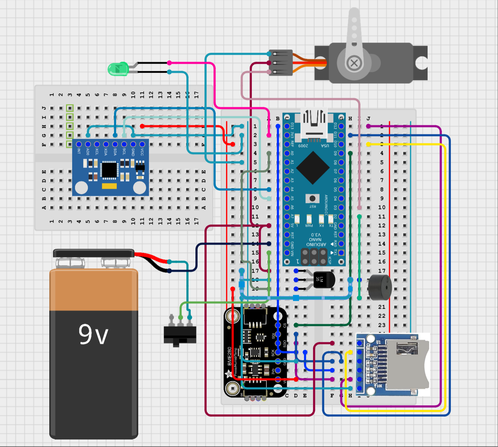

**其他语言版本: [English](README.md), [中文](README_ZH.md).**

# # 🚀 Arduino Water Rocket Flight Data Logger

一个基于 Arduino 的高精度水火箭飞行数据记录系统。通过多传感器融合与滤波算法，记录从发射到着陆的全过程数据，并实现自动降落伞释放与蜂鸣器着陆提示功能。兼容上位机实时数据可视化。

## 🧠 功能特性

- 使用 **MPU6050**（I2C）与 **BME280**（SPI）采集飞行姿态与环境数据
- 实现**卡尔曼滤波**和**BMP（气压高度）修正**算法，提高数据精度
- **SD卡按ms级时间间隔存储**完整飞行数据，时间间隔一致，便于后期分析
- 支持上位机实时显示
- 在**达到最高点或角度异常**时自动释放降落伞
- 火箭着陆后自动开启蜂鸣器提示信号，方便搜索

## 🛠️ 硬件连接
```
MPU6050: (I2C)
VCC      -> 3.3V
SCL      -> A5
SDA      -> A4
AD0      -> GND

BME280: (SPI)
VCC  -> 3.3V
SCK  -> D13
MISO -> D12
MOSI -> D11
CS   -> D9

SD Card: (SPI)
VCC  -> 5V
CS   -> D10
MOSI -> D11
MISO -> D12
SCK  -> D13

Servo:
PWM  -> D3
VCC  -> 5V
GND  -> GND

Buzzer:
+    -> D2
GND  -> GND 

LM35:
OUT -> A0
VCC -> 5V
GND -> GND
```

## 📦 软件功能概览

- ✅ 实时采集数据：姿态角（x, y, z）、加速度、气压、温度、时间戳等  
- ✅ 使用 Kalman 滤波优化 MPU6050 姿态数据  
- ✅ BMP（Barometric Pressure Method）用于高度修正  
- ✅ 判定最高点或角度突变（>120°）开伞（连续判断 3 次以避免误触）  
- ✅ 着陆后蜂鸣器自动响起（角速度和高度都接近零）  
- ✅ 所有数据以 CSV 格式保存到 SD 卡  
- ✅ 可直接在上位机使用FireWater数据引擎可视化分析

## 📂 数据格式（SD 卡存储）

示例（每行为一组数据，ms 时间戳）：
| Time(ms) | Temp(C) | Pressure(hPa) | Alt(m) | FiltAlt(m) | AccX(g) | AccY(g) | AccZ(g) | GyroX(deg/s) | GyroY(deg/s) | GyroZ(deg/s) | AngleX(deg) | AngleY(deg) | AngleZ(deg) | LM35Temp(C) |
|----------|---------|---------------|--------|------------|---------|---------|---------|--------------|--------------|--------------|-------------|-------------|-------------|-------------|
| 0        | 21.94   | 1013.11       | 0.55   | 0.11       | 0       | -0.04   | 0.98    | 1.84         | -2.7         | 2.32         | 2.67        | -4.63       | 3.8         | 21.48       |


## ✅ 开发与兼容性

- 开发环境：Arduino IDE  
- 所有依赖库可通过 Arduino Library Manager 安装
- 支持板卡：Arduino UNO / Nano / Mega 等  
- 支持上位机：Vofa+

## 📸 项目照片与演示


<video controls src="Demonstration/Vofa+.mp4" title="Title"></video>

---

## 📄 License

本项目以 MIT License 开源，欢迎学习与修改。如需商用请注明出处。

---

## 🙌 致谢

本项目是我们在**华威大学**参加的**ES192 工程设计课程**的一部分，

特别感谢以下出色的组员，在项目的设计、开发与测试过程中展现出极大的投入、合作精神与创造力：

- NGUYEN, Ryan  
- NIE, Jingren  
- CHAN, Rooney  
- JONES, Morgan  
- AL-DABAGH, Mouaid  
- HAQUE, Mayiz
- Boyu Zhang Bob (我)

同时也感谢开源硬件与软件社区，正是他们所提供的工具和资源使本项目得以实现。
